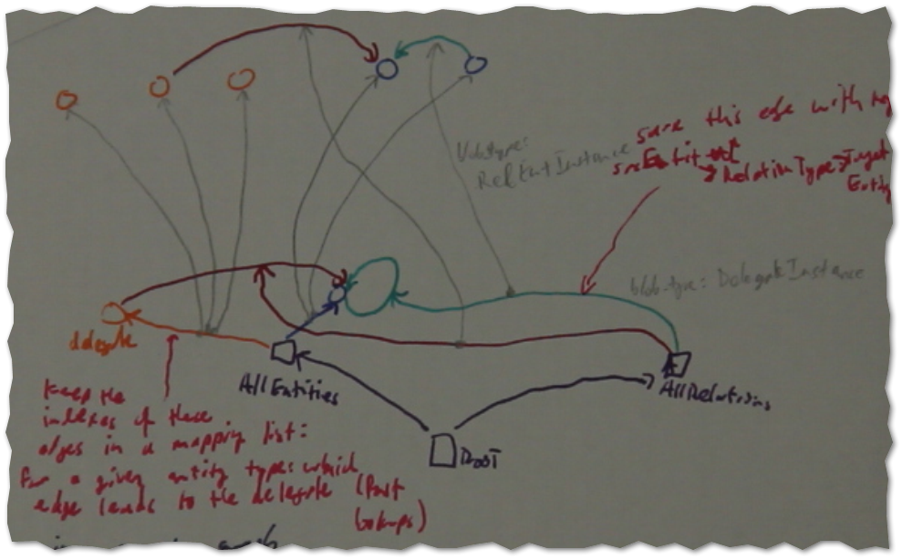
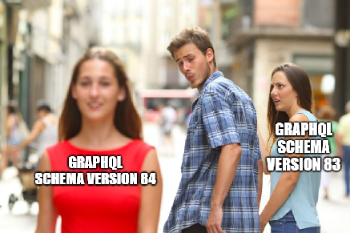

# zefDB

Nie jou ma se databasis nie.  

<!-- TOC -->

- [zefDB](#zefdb)
  - [Goal](#goal)
- [Requirements and Specifications](#requirements-and-specifications)
- [General Principles & Guidelines](#general-principles--guidelines)

<!-- /TOC -->

What is it? A database? Another Python data structure library? A language-independent platform for distributed computing? A fundamental data model? An approach to enable true multithreading on Python? A generalization of the uni-directional Elm-dataflow model to arbitrary data?
To be seen. It's about taking shit to the next level.

## Goal

zefDB is Synchronous' core data library to represent highly connected, time-dependent, live data. It is designed to address and solve some of the core problems we were facing previously. It's central goal is to prove a consistent, global framework to help us build a generalizable and scalable scheduling solution. Many problems must be overcome to achieve this goal.

# Requirements and Specifications

* Cross-Platform  / programming language communication
* the database is a value and can be treated like a local data structure for querying.
* Performance counts in the long run and is large determined by the data memory layout. This is hard/impossible to put in afterwards. Two areas where performance is critical: 1) read speeds for the simulations  2) write speed, given the strong consistency / single write head architecture

* Lazy loading for spawned sessions
* Graph structured data
* Fully versioned, transaction-based graph
* Inherently supports graph composition with strong owenership model of ZefRefs

* Git model for management between sessions and managing distributed data. But more granular than text files: Exploit graph structure and atomic information mode
* Granular information model that interfaces well with object picture, JSON, GraphQL & Relay

* Graph model: double linking for all high level information: Avoid large class of synchronization issues
* Architecture that facilitates simple CQRS and inherently scalable read system. Apply this approach to multi-core processing
* Single write head. For distributed information different policies possible. Default: single master node with write head.

* Granular information model with inherent strong distinction between entities and values.

* Observer nodes model for merging of graphs & systematic ownership
* Composable language for terse expressions of common query / traversal patterns
* Functional approach for composition and local definitions of DSL
* Strong extensibility:  allow overloading on any level / local namespace without affecting other parts.  This prohibits the common object-oriented approach
* Subscriptions inherently implemented on low level graph API with ability to include foreign graphs as local graph views

* Data Driven Design: put effort into finding the correct / most useful abstractions for a given real world problem. Fully expose data to the outside. The local user gets to decide which computations to perform.
* APIs are defined by data only → adaptable schema and API generated at runtime
* ZefSpec: declarative specifications of requirements for data to be fulfilled after each and every transaction
* No more migrations: embrace API schema and data structure changes at runtime. Build a system to deal with this correctly and perform the boring work. Unless no other way is found, keep this append only (preserving the old data)

* Schemas are data. Just saved in a special place of the graph away from the 'regular data'
* Lazy evaluation of queries: internal use of C++20 ranges
* For us the line blurs between traditional query languages (SQL, Gremlin, SparQL, ...) and compiled code expressions (we have unusual performance requirements in the simulation, but need to perform 'queries') → 
  domain-specific common query language (between Python, C++ and Julia) that compiles into machine code
* data with physical units accounted for at atomic level to avoid unit mismatches, esp. for non-CRUD operations / calculations

* transactional with context managers
* append only
* every attribute is a separate entity
* collector nodes
* Different primitives: the time-dependent character of lowest level data model is accounted for from first principiles: allows for a different model of collaboration 

# General Principles & Guidelines

* Don't communicate by sharing memory. Share memory by communicating
* PubSub / observer pattern for any critical / live data

* Value-based communication on all levels (including blobs for cross-function communication)
* Favor composition over inheritance

